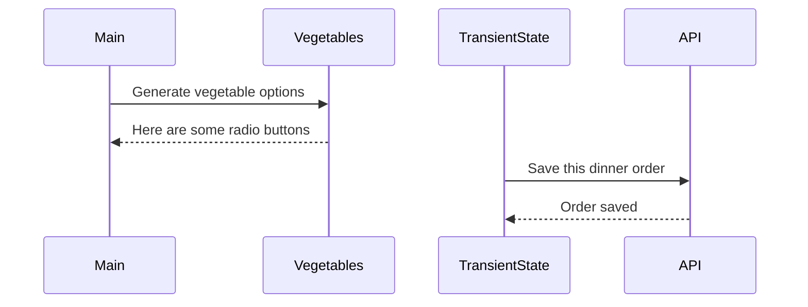

# Events and State Self-Assessment

> 🧨 Make sure you answer the vocabulary and understanding questions at the end of this document before notifying your coaches that you are done with the project

## Setup

1. Make sure you are in your `workspace` directory
1. `git clone {github repo SSH string}`
1. `cd` into the directory it creates
1. `code .` to open the project code
1. Use the `serve` command to start the web server
1. Open the URL provided in Chrome

## Requirements

### Initial Render

1. All 10 base dishes should be displayed as radio input options.
1. All 9 vegetables should be displayed as radio input options.
1. All 6 side dishes should be displayed as radio input options.
1. All previously purchases meals should be displayed below the meal options. Each purchase should display the primary key and the total cost of the purcahsed meal.

### State Management

1. When the user selects an item in any of the three columns, the choice should be stored as transient state.
1. When a user makes a choice for all three kinds of food, and then clicks the "Purchase Combo" button, a new sales object should be...
    1. Stored as permanent state in your local API.
    1. Represented as HTML below the **Monthly Sales** header in the following format **_exactly_**. Your output will not have zeroes, but the actual amount.
        ```html
        Receipt #1 = $00.00
        ```
   1. The user's choices should be cleared from transient state once the purchase is made.

## Design

Given the description and animation above...

1. Create an ERD for this application before you begin.
1. Make a list of what modules need to be created to make your application as modular as possible. Create a **Dependency Graph** for the project to be reviewed once you are complete with the assessment.
1. Create a **Sequence Diagram** that visualizes what your algorithm is for this project. We'll give you a minimal starting point.



## Vocabulary and Understanding

> 🧨 Before you click the "Assessment Complete" button on the Learning Platform, add your answers below for each question and make a commit. It is your option to request a face-to-face meeting with a coach for a vocabulary review.

1. Should transient state be represented in a database diagram? Why, or why not?
   > The transient state should not be represented in the database diagram. It holds similar information but only temporarily. the transient state stores that information that the user is selecting until they submit it and it becomes permanent/added to the database. once the order has been submitted, the transient state is wiped clean until the next order. it basically holds temporary memory until it becomes permanent by being submitted and added to the database.
2. In the **FoodTruck** module, you are **await**ing the invocataion of all of the component functions _(e.g. sales, veggie options, etc.)_. Why must you use the `await` keyword there? Explain what happens if you remove it.
   > async and await on entrees/sales/veggie options etc are making the food truck wait until it has the information loaded from those functions. without it, the food truck would have nothing to select from if it loaded before any of the actual information it needs. I made a mistake during the project and caused this exact issue. The page just showed [object Promise]. This was the function returning a Promise object immediately, resolving and using the promise as a placeholder before the actual data arrived because it couldn't access the actual information.
3. When the user is making choices by selecting radio buttons, explain how that data is retained so that the **Purchase Combo** button works correctly.
   > The data begins by being stored as a value in the `currentOrder` object. This object has null properties which allows it to retain the information as the user selects options. When the user clicks a radio button for an entree, the function `EntreeEvents` (the click event checking for if the user is pressing anything with the data type "entree") will call the setter function  `setEntree` which will pass whatever the chosen value is (the option chosen by pressing the radio button) and temporarily saves that value into the transient state `currentOrder`. All of the setter functions work this way. The function `isOrderComplete` is checking to see if all 3 setters (entree, vegetable, side) have run and have a value, returning `true` if the values are no longer `null`. Basically, it is checking to see if the transient state has a value (not null) for each currentOrder property. If one is still null, it will return `false` and not allow for the submission button to be pressed. If it returns `true`, the user can press the submit button, adding the order to the permanent database. Lastly, the function clearOrder wipes the slate clean, resetting the transient state so that the next order can be stored.
4. You used the `map()` array method in the self assessment _(at least, you should have since it is a learning objective)_. Explain why that function is helpful as a replacement for a `for..of` loop.
   > It goes through every item in an array and returns a  new array after transforming all of the items. It automatically collects all of the results and creates a finished array. In my own code, example below, the .map() function is running through the purchasesArray and making each item in the array into an HTML string. In a for..of loop, I would have to declare an empty variable and have it join the strings together with +=, adding each run/output of the for..of loop on to the end of the last variable. This process is more manual while the .map() array method automatically does it. (i also want to add- in this example, the .toFixed(2) number method is automatically checking the number and rounding it and/or adding a 0. for example, 4.5 would be 4.50 or 30.49409404 would round up to 30.50. the .join("") array method is taking the new array created by .map() and making it all into the same HTML string, instead of "1""2""3" itd be "123")
   const html = purchasesArray.map(purchase => `
   <p>Receipt #${purchase.id} = $${purchase.total.toFixed(2)}</p>`).join("")